# Class foods (food)

| Objectname               |  Image                   |
:-------------------------:|:-------------------------:
| noodles  |  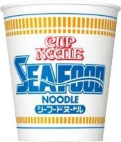 |
| potato_chips  |  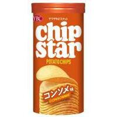 |
| cookies  |  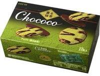 |
| cracker  |  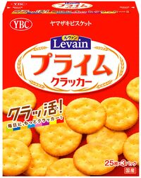 |

# Class dummy_items (dummy_item)

| Objectname               |  Image                   |
:-------------------------:|:-------------------------:
| coffee  |  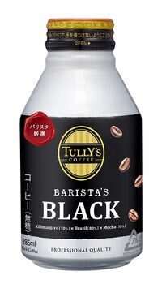 |

# Class bag_items (bag_item)

| Objectname               |  Image                   |
:-------------------------:|:-------------------------:
| bag  |  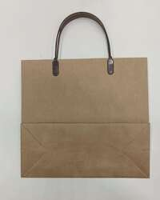 |

# Class task_items (task_item)

| Objectname               |  Image                   |
:-------------------------:|:-------------------------:
| dice  |  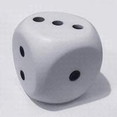 |
| light_bulb  |  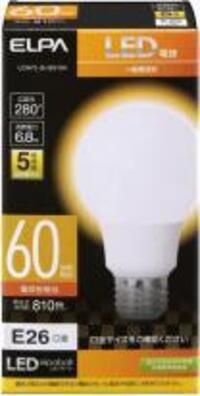 |
| block  |  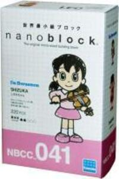 |
| table_clock  |  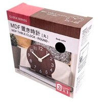 |

# Class kitchen_items (kitchen_item)

| Objectname               |  Image                   |
:-------------------------:|:-------------------------:
| freezer_bag  |  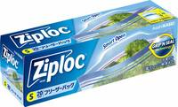 |
| lunch_box  |  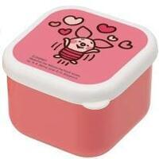 |
| cup  |  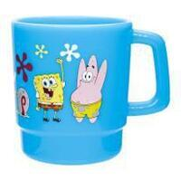 |
| detergent  |  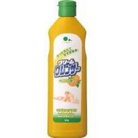 |

